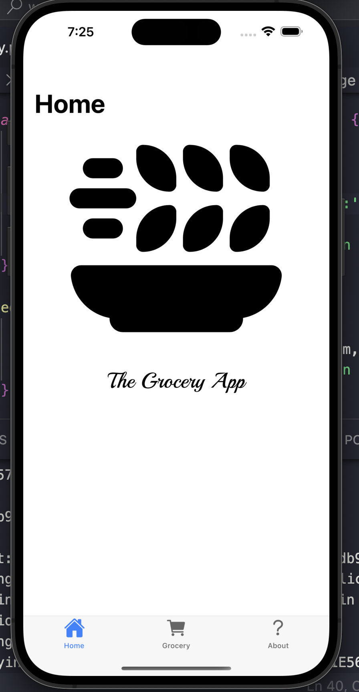
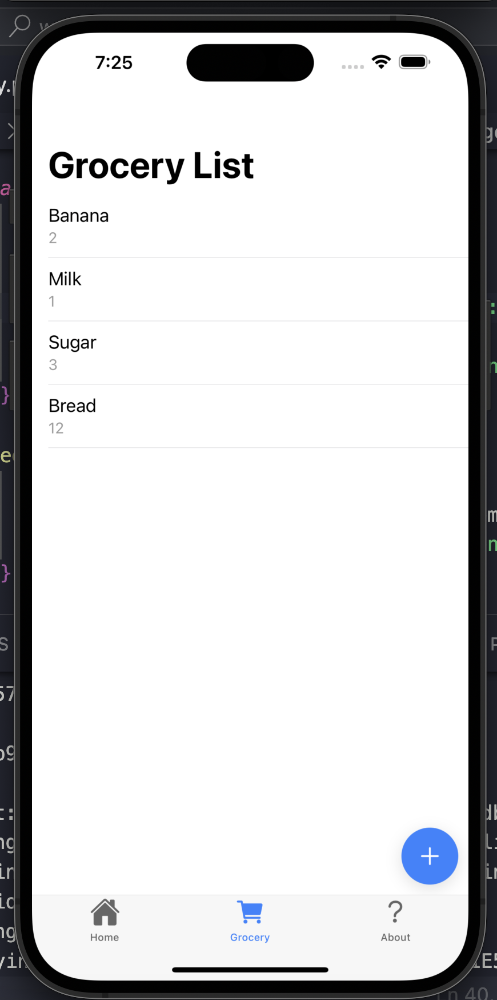
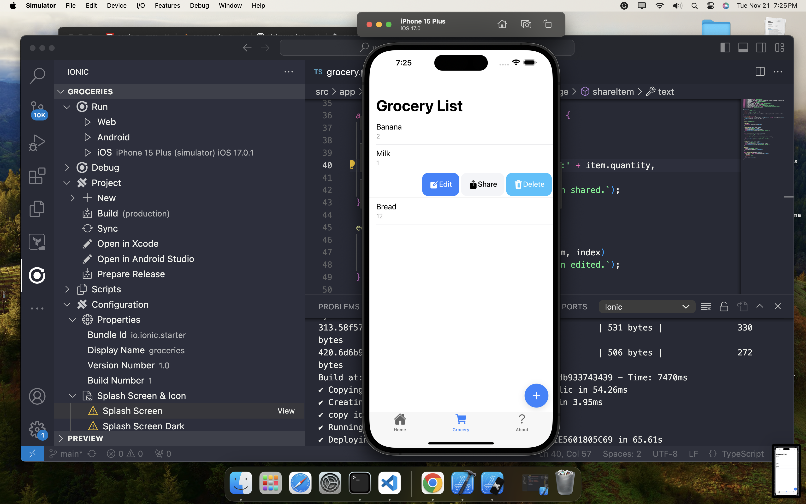
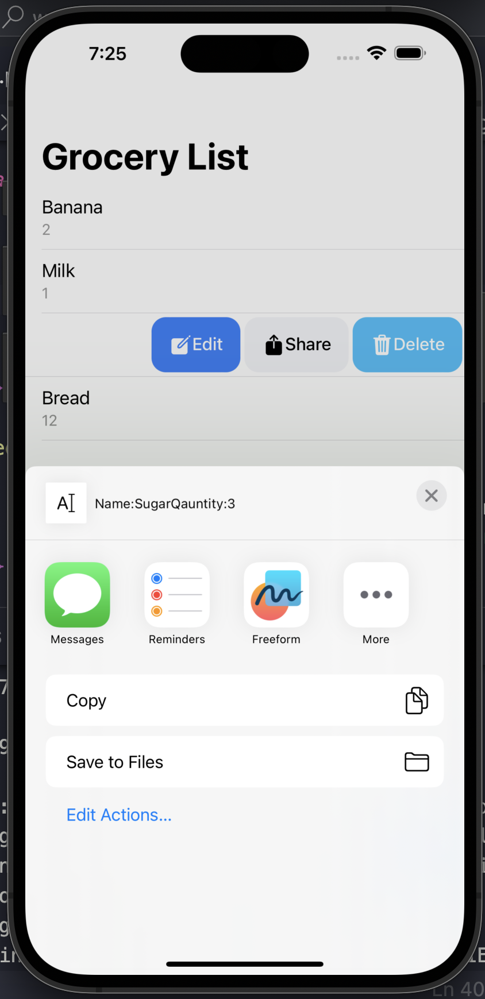
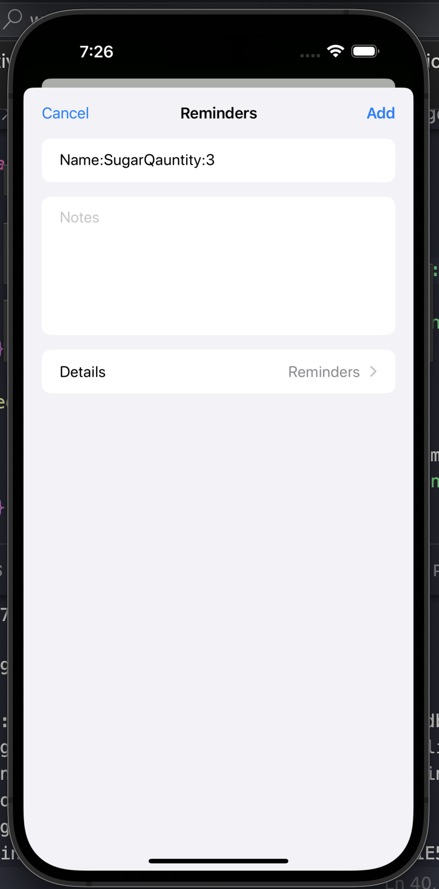

# Week 5 Groceries App
## Requirements

By end of this week, the Groceries app should be able to perform create, read, update, and delete (CRUD) operations. For our week 4 assignment, complete the following steps:


Access the assignment on GitHub Classroom. Here is the GitHub Classroom assignment link: REMOVED Links to an external site..

As discussed in the video, the current status of the app should do add and delete operations.  

- Capture the screenshots of each tab or screencast walking through the flow of each tab.
- Create a folder called 'screenshots' or 'screencasts' and depending on what you generate. It is OK to have both screenshots and screencasts.
- Commit the generated screenshots or screencasts files in the GitHub assignment repo.
- When you submit this assignment here in Canvas, I would like you to answer the following question(s):
- - How many hours do you estimate you used completing this assignment?
- - What was easiest for you when completing this assignment?
- - What was the most difficult challenge you experienced when completing this assignment?

## Run
```bash
npm install
ionic serve
# visit http://localhost:8100

# or use Ionic Extension in VS Code and launch with IOS
```

# Screenshots




